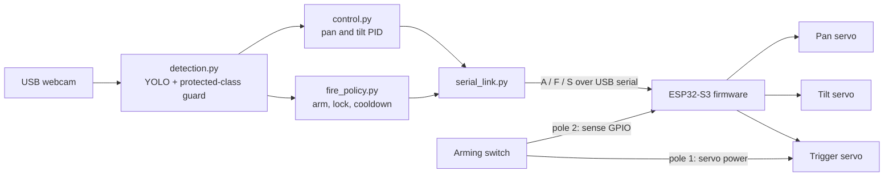

# Leclerc: vision-guided pan-tilt foam-dart turret

Leclerc is an autonomous pan-tilt turret that finds an inert target with a
webcam and a YOLO detector, centers it under a calibrated crosshair with two
PID loops, and fires a single NERF-style foam dart when a strict, multi-layer
fire policy allows it. Targets are cardboard shapes, balloons and a small
mobile robot.

It is an embedded-systems and computer-vision portfolio project: a small
real-time firmware on an ESP32-S3, a Python host that does perception and
control, a plain-text serial protocol between them, and safety interlocks that
live in hardware, in firmware and in software.

> **This is a target-practice demonstrator.** It is built for foam darts and
> inert targets only. Read the [Safety](#safety) section before powering it.

## Contents

- [Safety](#safety)
- [How it works](#how-it-works)
- [Repository layout](#repository-layout)
- [Hardware and wiring](#hardware-and-wiring)
- [Firmware: build and flash](#firmware-build-and-flash)
- [Host: install and run](#host-install-and-run)
- [Calibration walkthrough](#calibration-walkthrough)
- [Training a custom detector](#training-a-custom-detector)
- [Serial protocol](#serial-protocol)
- [Testing](#testing)
- [License](#license)

## Safety

Read this section in full. The software cannot make an unsafe setup safe.

- **Foam darts only.** Use an unmodified, stock-power foam dart blaster. Never
  upgrade springs or motors, never load anything other than foam darts.
- **Inert targets only.** Cardboard, balloons, a small robot. Never aim the
  turret at people, animals, or anything fragile. **Never at faces.**
- **Eye protection** for everyone in the room while the turret is powered.
- **Physical arming switch.** A double-pole switch cuts power to the trigger
  servo and, on its second pole, tells the firmware whether the turret is
  armed. With the switch off the trigger servo has no power, whatever the
  software does. Keep it off whenever you are not actively testing.
- **Start disarmed.** The host always starts in MANUAL mode with the software
  arm flag cleared. Switching modes, losing the serial link, or turning the
  hardware switch off all clear the software arm flag again.
- **Firing needs every layer to agree.** A dart is fired only when the
  hardware switch is on, the firmware accepts the command (switch read as
  armed, link alive, trigger idle, cooldown elapsed), and the host fire policy
  agrees (software armed, target locked, cooldown elapsed, status fresh, no
  protected class in view). There is no override for any of these checks.
- **Protected classes veto firing.** Whenever the guard model sees a person or
  a pet anywhere in the frame, firing is inhibited. This is a best-effort extra
  layer on top of the rules above, never a replacement for them: a detector
  can miss.
- **Limit the field of fire.** Set the pan and tilt limits in
  `firmware/include/config.h` so the barrel can only point at the target area,
  for example below head height and away from doors. These limits are
  enforced by the firmware, whatever the host sends.
- **Supervise it.** Never leave the turret powered and armed unattended. Keep
  a clear backstop behind the targets.

## How it works



The system is split into two components that talk over USB serial:

1. **`firmware/`** (C++, Arduino framework, PlatformIO, ESP32Servo) runs on an
   ESP32-S3. It drives the pan, tilt and trigger servos and enforces the hard
   safety rules: angle clamping, arming switch check, trigger sweep with a
   minimum cooldown, and a link watchdog that holds position and disables
   firing when the host goes quiet. The main loop is non-blocking and
   `millis()` based.
2. **`host/`** (Python 3, Ultralytics YOLO, OpenCV, pyserial) runs on a PC or
   a Raspberry Pi with the webcam attached. It detects targets, computes the
   pixel error between the target and a calibrated crosshair, converts it into
   servo angle corrections with two independent PID controllers, and decides
   when a shot is allowed.

The camera sits directly below the barrel in the same vertical plane, so the
horizontal parallax is close to zero and the remaining vertical offset is
absorbed by the crosshair calibration and an optional distance-based tilt
holdover table.

### Control loop

For each camera frame the host:

1. Runs the detector and keeps the best target (nearest to the crosshair or
   highest confidence) among the configured target classes.
2. Computes the error between the target's box center and the aim point
   (the calibrated crosshair, shifted by the holdover for the estimated
   distance).
3. Converts the pixel error to degrees with the calibrated deg/pixel, feeds it
   to the pan and tilt PIDs, and sends the new absolute angles with `A`.
4. Asks the fire policy whether a shot is allowed; if so, sends `F`.
5. Polls the firmware with `S` a few times per second, which also keeps the
   firmware link watchdog alive.

## Repository layout

```text
.
|-- firmware/                ESP32-S3 firmware (PlatformIO project)
|   |-- platformio.ini
|   |-- include/config.h     every pin, angle limit and timing in one place
|   |-- src/                 parser, aim axes, trigger sequencer, arming, watchdog
|   `-- test/                native unit tests (Unity)
|-- host/                    Python vision and control host
|   |-- config.yaml          every tunable: PID gains, thresholds, calibration
|   |-- main.py              MANUAL and AUTO modes
|   |-- calibration.py       crosshair, deg/pixel, holdover table
|   |-- detection.py         camera capture, YOLO, target selection, veto
|   |-- control.py           PID, aim controller, holdover ballistics
|   |-- fire_policy.py       software fire policy and protected classes
|   |-- serial_link.py       serial protocol client and firmware simulator
|   |-- turret.py            the single place where a shot is requested
|   |-- settings.py          config.yaml loading, validation and saving
|   |-- overlay.py           heads-up display
|   |-- requirements.txt     runtime dependencies
|   |-- requirements-dev.txt test and lint dependencies
|   `-- tests/               pytest unit tests
|-- training/                YOLO dataset layout and training example
|-- docs/                    wiring notes, bill of materials, protocol spec
`-- .github/workflows/       CI: lint, host tests, firmware tests and build
```

## Hardware and wiring

| Part | Role |
| --- | --- |
| ESP32-S3 dev board | Servo PWM, arming switch sense, USB serial to the host |
| Pan servo | Base rotation (X) |
| Tilt servo, high torque (MG996R class) | Elevation (Y) |
| Trigger servo | Pulls the blaster trigger |
| USB UVC webcam | Mounted directly below the barrel, connected to the host |
| Double-pole arming switch | Cuts trigger servo power and reports armed state |
| 5 to 6 V servo supply | Powers the servos, ground shared with the ESP32 |
| PC or Raspberry Pi | Runs the Python host |

Default pin map (edit `firmware/include/config.h` to change it):

| Signal | ESP32-S3 GPIO |
| --- | --- |
| Pan servo signal | 4 |
| Tilt servo signal | 5 |
| Trigger servo signal | 6 |
| Arming switch sense (pole 2 to GND, internal pull-up) | 7 |
| Optional armed indicator LED | 15 |

The servos are powered from their own supply, never from the ESP32 3.3 V or
USB 5 V pin. Pole 1 of the arming switch sits in series with the trigger
servo's positive supply only; pole 2 pulls the sense GPIO to ground when the
switch is on. A broken sense wire reads as DISARMED, so the failure is safe.

Full details: [docs/wiring.md](docs/wiring.md) and
[docs/bill_of_materials.md](docs/bill_of_materials.md).

## Firmware: build and flash

Requirements: [PlatformIO Core](https://platformio.org/install/cli) or the
PlatformIO IDE extension.

```bash
cd firmware
pio run                      # build for the ESP32-S3
pio run -t upload            # flash over USB
pio device monitor           # 115200 baud serial console
pio test -e native           # run the logic unit tests on your computer
```

Before the first upload, review `firmware/include/config.h`: pins, pan and
tilt limits, home angles, trigger pull and rest angles, sweep timings, shot
cooldown and the link timeout. The trigger angles depend on how the servo horn
meets the blaster trigger, so test them with the arming switch off first, by
moving the horn by hand, then with darts removed.

You can talk to the firmware by hand from the serial monitor:

```text
S              -> STATUS armed=0 link=1 pan=90.00 tilt=90.00 trigger=IDLE cooldown_ms=0
A100 85        -> (no reply on success)
F              -> FIRE DENIED DISARMED
```

## Host: install and run

Requirements: Python 3.10 or newer, a UVC webcam, the ESP32 on USB.

```bash
cd host
python -m venv .venv
source .venv/bin/activate          # Windows: .venv\Scripts\activate
pip install -r requirements.txt
```

Edit `host/config.yaml`: at least `serial.port` (for example `/dev/ttyACM0`,
`/dev/ttyUSB0` or `COM5`) and `camera.source`. Then:

```bash
python main.py                     # real turret
python main.py --simulate          # no ESP32 needed, firmware is simulated
python main.py --source clip.mp4   # run on a recorded video instead of the webcam
```

The first run downloads the pretrained YOLO weights named in
`detection.model_path`. To use your own detector, point `model_path` at your
trained `best.pt` and list its class names in `detection.target_classes`.

With `--simulate`, a software model of the firmware replaces the ESP32: same
replies, limits, watchdog and cooldown. Its arming switch is always off, so it
shows tracking and the fire policy at work but refuses every shot, exactly as
the real firmware does with the switch off.

**Frame rate and the link watchdog.** The status poll that keeps the firmware
link alive runs in the vision loop on purpose: if the host stalls, the
firmware stops accepting shots after 500 ms. Keep each frame well under that
(a few tens of milliseconds on a laptop). On a Raspberry Pi, use
`detection.image_size: 320` or a smaller model if the frame rate drops.

### Modes and controls

The host starts in **MANUAL** mode and **software-disarmed**.

| Key | Action |
| --- | --- |
| `m` | Toggle MANUAL / AUTO (always clears the software arm flag) |
| `x` | Toggle the software arm flag |
| `w` `a` `s` `d` | Nudge tilt and pan (MANUAL), hold Shift for coarse steps |
| `space` | Fire one dart (MANUAL, still checked by the fire policy) |
| `h` | Return to the home position |
| `q` or `Esc` | Quit (disarms and returns home) |

In **AUTO** mode the turret tracks the best target and the fire policy decides
when to shoot. A shot requires every condition below; the heads-up display
lists the ones that are currently blocking.

- software armed (`x`) and hardware switch reported armed by the firmware
- a fresh firmware status (the serial link is alive)
- a target present, with both pixel errors under `fire_policy.error_threshold_px`
  for `fire_policy.lock_frames` consecutive frames
- `fire_policy.cooldown_s` elapsed since the previous shot request
- no protected class (person, cat, dog, bird) visible in the frame

In MANUAL mode the target lock condition is dropped (you are aiming); every
other condition still applies.

## Calibration walkthrough

All calibration results are written back into `host/config.yaml`, keeping its
comments. Run the steps in order the first time; each one can be repeated on
its own. Keep the arming switch **off** for steps 1 and 2.

### 1. Crosshair pixel

```bash
python calibration.py crosshair
```

The crosshair is the pixel the barrel actually points at, not the image
center. It is only valid at the camera resolution set in `config.yaml`; the
host warns when the frames have another size. Bore-sight the blaster: look along the barrel (or use a bore laser) at
a small, distant, high-contrast mark, then click that mark in the window. Fine
tune with `w` `a` `s` `d`, press `Enter` to save or `Esc` to cancel.

### 2. Degrees per pixel

```bash
python calibration.py degpx
```

Aim the turret with `w` `a` `s` `d` at a textured, static scene (a bookshelf
works well) and press `Enter` once the link is up. For each axis the tool grabs
a frame, nudges the servo by a few degrees in both
directions, grabs a frame each time, and measures the image shift with phase
correlation. It stores `deg_per_px` and the sign (`direction`) that maps a
pixel error to the servo rotation correcting it. A shift that is too small or
a weak correlation is rejected with a hint.

### 3. Holdover table (optional)

```bash
python calibration.py holdover
```

Foam darts drop. This step records how much extra tilt is needed at each
distance. Place a target at a known distance, set that distance with `[` and
`]`, aim the crosshair at the target center with `w` `a` `s` `d`, arm (`x`
plus the hardware switch) and fire a test shot with `space`. Click where the
dart hit. The vertical offset between the crosshair and the impact is
converted into degrees and stored for that distance. Repeat at a few
distances, then press `Enter` to save. `u` removes the point recorded at the
current distance. Every test shot goes through the same fire policy and
firmware checks as in `main.py`, including the protected-class veto.

During tracking, the host estimates the target distance from its bounding box
height (`ballistics.target_height_m`) and the camera focal length derived from
the tilt deg/pixel, interpolates the table, and moves the aim point
accordingly. Set `target_height_m` to `0` to disable holdover.

### 4. Tune the PIDs

Start with the defaults in `config.yaml` (`kp` around 0.5, small `ki` and
`kd`). Raise `kp` until tracking is quick without overshoot, add a little `kd`
if it oscillates, and a little `ki` if it lags behind a moving target.

## Training a custom detector

The pretrained COCO model has no class for a balloon, a cardboard target or a
small robot. [training/README.md](training/README.md) describes the YOLO
dataset layout (images and labels split, `dataset.yaml`) and
[training/train.py](training/train.py) trains a model whose `best.pt` you can
use directly in `host/config.yaml`. No dataset is included in this repository.

## Serial protocol

115200 baud, newline-terminated ASCII lines.

| Host to firmware | Meaning |
| --- | --- |
| `A<pan> <tilt>` | Set absolute pan and tilt angles in degrees (floats), clamped by the firmware |
| `F` | Request one trigger pull |
| `S` | Request a status line |

| Firmware to host | Meaning |
| --- | --- |
| `READY <version>` | Boot banner |
| `STATUS armed=<0/1> link=<0/1> pan=<deg> tilt=<deg> trigger=<state> cooldown_ms=<ms>` | Reply to `S` |
| `FIRE OK` or `FIRE DENIED <reason>` | Reply to `F`, reason is `DISARMED`, `LINK`, `BUSY` or `COOLDOWN` |
| `EVT ARM <0/1>` and `EVT LINK <0/1>` | Unsolicited state changes |
| `ERR <code>` | Malformed or unknown command |

Every valid command feeds the firmware link watchdog. When no command arrives
for `kLinkTimeoutMs`, the firmware freezes the pan and tilt servos where they
are, releases the trigger and refuses `F` until an `A` or `S` command
re-establishes the link. Full specification:
[docs/protocol.md](docs/protocol.md).

## Testing

```bash
# Firmware logic (parser, clamping, trigger sequencer, arming, watchdog)
cd firmware && pio test -e native

# Host logic (PID, aim controller, fire policy, protocol, config, simulator)
cd host && pip install -r requirements-dev.txt && pytest

# Lint and formatting, from the repository root
ruff check . && ruff format --check .
```

The unit tests run without a camera, a GPU, YOLO weights or an ESP32; tests
that need OpenCV are skipped when it is not installed. GitHub Actions runs all
of the above, plus the ESP32-S3 firmware build, on every push.

## License

[MIT](LICENSE)
